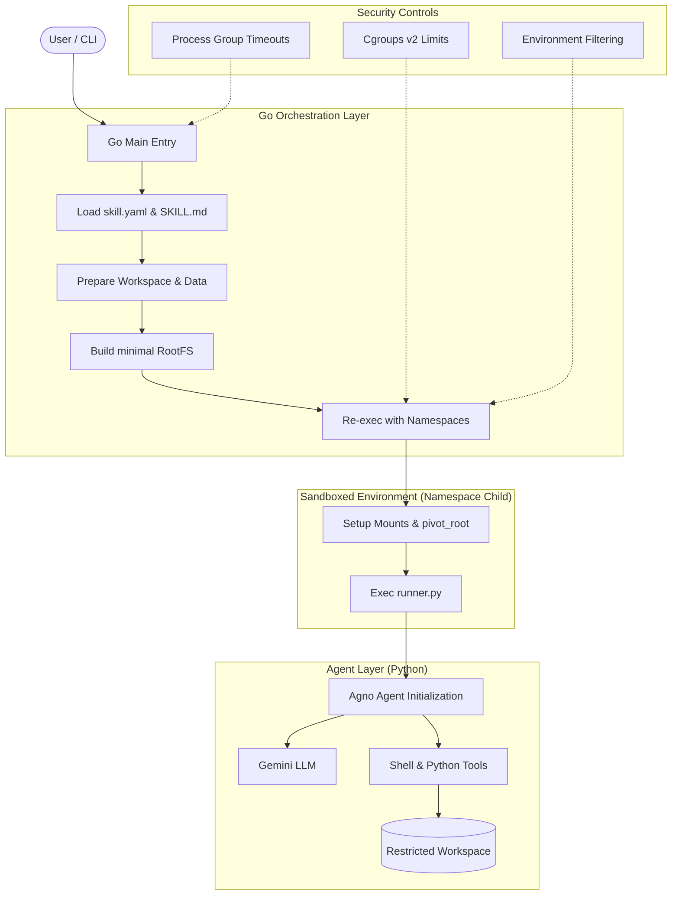

# Architecture: Agno Skill Runner

The Agno Skill Runner is a namespace-based isolation tool for running LLM-based agents. It combines a Go orchestrator with a sandboxed Python execution environment.

**Status**: Version 1.0, initial implementation (April 2026). This design has not been evaluated by external security researchers or tested against adversarial agents. Use for execution isolation in trusted environments, not for containing untrusted code.

## System Overview

The system is divided into three primary layers:
1.  **CLI/Orchestration (Go)**: Handles configuration, workspace preparation, and sandbox lifecycle.
2.  **Sandbox (Linux Namespaces)**: Provides filesystem, process, and user isolation.
3.  **Agent (Python/Agno)**: Executes the LLM logic and interacts with tools within the sandbox.

## Process Flow & Architecture

The following diagram illustrates the lifecycle of a skill execution, from the initial CLI call to the sandboxed agent execution.

## Core Components

### 1. The Go Orchestrator (`cmd/skill-runner`)
The orchestrator is responsible for:
-   **Skill Discovery**: Finding the requested skill configuration in the `skills/` directory.
-   **Workspace Management**: Creating isolated directories for each run (`runs/run-XXXX`).
-   **RootFS Construction**: Creating a temporary directory with symlinks to allowed binaries (whitelisting).
-   **Re-execution Pattern**: To safely enter Linux namespaces, the binary re-executes itself with `CLONE_NEWUSER`, `CLONE_NEWNS`, and `CLONE_NEWPID`.

### 2. The Sandbox Layer (`internal/sandbox`)
The sandbox provides several layers of defense:
-   **Mount Namespaces**: Uses `pivot_root` to change the root filesystem to a minimal environment. Only `/usr`, `/lib`, and `/lib64` are bind-mounted read-only. Host `/home`, `/root`, and `/etc` are hidden.
-   **User Namespaces**: Allows the runner to perform "root-like" operations (like mounting) without actual host root privileges.
-   **PID Namespaces**: The agent can only see its own processes, preventing it from inspecting the host process tree.
-   **Cgroups v2**: Enforces memory and CPU limits to prevent resource exhaustion.
-   **Process Groups**: All child processes are placed in a single group to ensure clean termination on timeout.

### 3. The Python Runner (`runner.py`)
The Python runner is the bridge between the sandbox and the Agno framework:
-   **Agno Integration**: Initializes an `agno.agent.Agent` with the `Gemini` model.
-   **Tool Provisioning**: Configures `ShellTools` and `PythonTools` for the agent.
-   **Instruction Injection**: Loads agent persona and system instructions from `SKILL.md`.

## Security Model (Attempted vs. Guaranteed)

| Feature | Mechanism | Status | Notes |
| :--- | :--- | :--- | :--- |
| **Credential Protection** | Environment Filtering | ✓ Guaranteed | Strips `HOME`, `SSH_AUTH_SOCK`, etc. Only API keys are passed. Works in all modes. |
| **Filesystem Isolation** | Mount Namespaces | ⚠️ Namespace-mode only | `pivot_root` hides host home/root/etc. Fails back to open access if namespace unavailable. |
| **Command Whitelisting** | PATH Restriction | ✗ Easily bypassed | Symlinks prevent accidental tool use; agent can still invoke `/usr/bin/X` by absolute path. Treat as documentation. |
| **Resource Limits** | Cgroups v2 | ⚠️ Best-effort | Fails silently on containers & many VMs. Timeout is the only guaranteed limit. |
| **Process Cleanup** | Process Groups + SIGKILL | ✓ Guaranteed | All subprocesses killed on timeout or exit. Works in all modes. |

## Data Flow
1.  **Input**: User prompt and skill name via CLI.
2.  **Preparation**: Go copies necessary data to a fresh workspace.
3.  **Execution**: Python runner executes inside the workspace.
4.  **Output**: Agent responses are streamed to `stdout`, and logs are captured to `skill-runner.log`.
5.  **Cleanup**: Temporary RootFS and sandbox resources are released.
